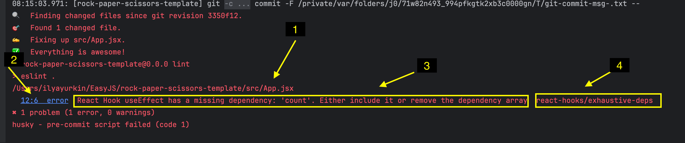

# README

## 🪝Git хуки в проекте

В этом репозитории настроены git-хуки через [Husky](https://typicode.github.io/husky/get-started.html). Они автоматически запускают проверки перед коммитом:

- ✅ [ESLint](https://eslint.org/docs/latest/use/getting-started) — проверка качества кода JavaScript
- ✅ [Prettier](https://prettier.io/docs/) — автоформатирование

**Что происходит при коммите**
Перед каждым коммитом автоматически запускаются команды:

```bash
npx pretty-quick --staged # не вызывает ошибок, молча форматирует код
npm run lint # может показывать ошибки
```

Если есть ошибки, коммит будет отклонён, и ты увидишь сообщения об ошибках в терминале или IDE.

### ⚠️ Если коммит не проходит

- Запусти вручную:

```bash
npm run lint
```

- ESLint сообщит, в чём проблема
  

1. Путь до файла, в котором есть проблемы
2. Точная строка в файле с ошибкой. Если запускаешь в IDE, то можешь нажать на нее и файл откроется в нужном месте
3. Краткое описание проблемы. Если не понятно - используй переводчик, никто не осудит
4. Название правила, которое вызывает ошибку

### Как решать?

Если после просмотра кода и краткого описания все еще не понятно что нужно делать - не беда.

1. Вбивай в гугл запрос `eslint [название правила]`, типа `eslint react-hooks/exhaustive-deps` и смотри ответы
2. Спроси у ChatGPT.
   1. Скопируй проблемный участок кода
   2. Используй промпт: "В этом участке кода на строке X возникает ошибка eslint [Y], как поправить?"
